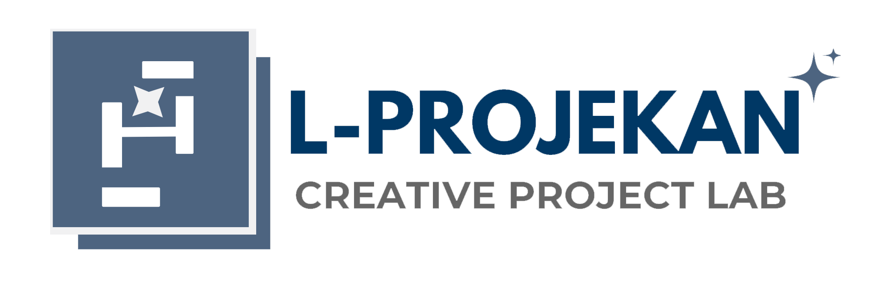

# L-Projekan Website Version 1.0


_This website will be updated gradually in the future._

## Project Description
The L-Projekan website is a digital platform offering various professional creative services for academic and business needs. This website is designed to:
- Display L-Projekan's profile and services
- Provide comprehensive information about offered services
- Showcase client testimonials
- Facilitate potential clients in contacting the L-Projekan team

## Key Features
1. **Responsive Design** - Optimal display on all devices (desktop, tablet, mobile)
2. **Modern UI/UX** - Clean design with interactive animations
3. **Intuitive Navigation** - Navigation menu with smooth scrolling effects
4. **Services Section** - Displays 4 main services with visual icons
5. **Testimonials** - Client reviews with star rating system
6. **Interactive FAQ** - Frequently asked questions with expand/collapse system
7. **Direct Contact** - Order buttons and social media links

## Technologies Used
- **HTML5** - Basic website structure
- **CSS3** - Styling with custom properties (CSS variables)
- **JavaScript** - Interactions and special functions
- **Font Awesome** - Vector icons
- **Google Fonts** - Modern typography

## File Structure
```
├── index.html          # Main page
├── style.css           # Main stylesheet
├── script.js           # JavaScript for interactions
├── assets/
│   ├── images/         # Content images
│   ├── icon/           # Icons and logos
│   └── font/           # Custom font files
```

## How to Run
1. Clone the repository:
   ```bash
   git clone https://github.com/L-Projekan/Beranda
   ```
2. Open the `index.html` file in a modern browser
3. No special server required - the website runs statically

## Important Links
- [Order Form](https://docs.google.com/forms/d/e/1FAIpQLSfe1mAfNRUBI0cAYrbIZNv5T_iYGKSuMRAb1-9xaV-1YlEClg/viewform)
- [L-Projekan Instagram](https://instagram.com/lprojekan)
- [L-Projekan WhatsApp](https://wa.me/6285903794445)

## Color Theme
```css
:root {
    --primary: #4b6281;
    --secondary: #6c7b94;
    --accent: #3b82f6;
    --light: #f8fafc;
    --dark: #1e293b;
    --gradient: linear-gradient(135deg, #4b6281, #3b82f6);
}
```

## Responsiveness
The website has been optimized for:
- Desktop (≥1024px)
- Tablet (768px - 1023px)
- Mobile (≤767px)

## Contribution
Contributions are welcome! Please fork the repository and submit a pull request. Ensure:
1. Code follows existing patterns
2. Tested across various screen sizes
3. Doesn't break existing functionality

## License
This project is licensed under [All Rights Reserved](https://en.wikipedia.org/wiki/All_rights_reserved) - L-Projekan © 2025

---

**L-Projekan** - Trusted digital solutions for all your creative needs

#### Cloudflare version of Web Link
https://l-projekan.pages.dev


